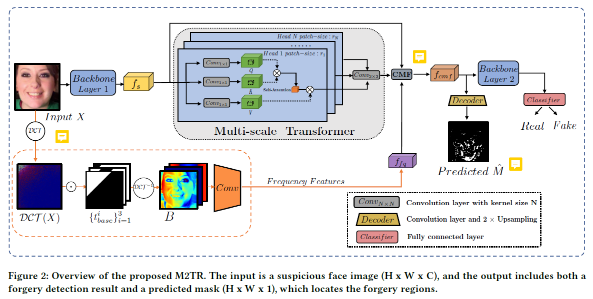

# M2TR Multi-modal Multi-scale Transformers for Deepfake Detection

https://arxiv.org/pdf/2104.09770.pdf

This is my first time to recode the model from the paper. If these is something mistaking or you don't know, please tell me.

email: 729946969@qq.com

zhihu homepage: https://www.zhihu.com/people/ishihara-32

microblog homepage: https://weibo.com/u/6322632992



I don't have the dataset of the paper authors, so I can't code the Decoder part.

## requirement

Please run this comment to download the requirement

```shell
pip install requirement.txt
```

## using your own dataset

If you want to use your own dataset , please modify the train.py on here to your own data path.

```python
parser.add_argument('--data-path', type=str,
                        default=r"C:\Users\satomi ishihara\za\desktop\fakeface\train_fake")
```

And the default validate rate is 0.2, which means that the train data will be divided to 4:1 to training and validating. If you want to change this rate , please modify the utils.py on here to your own rate.

```python
def read_split_data(root: str, val_rate: float = 0.2)
```

Any parameter you can change in the train.py such as the epoch number, learning rate, and so on. Anything is ready and then you can run the train.py to start train your own model.
